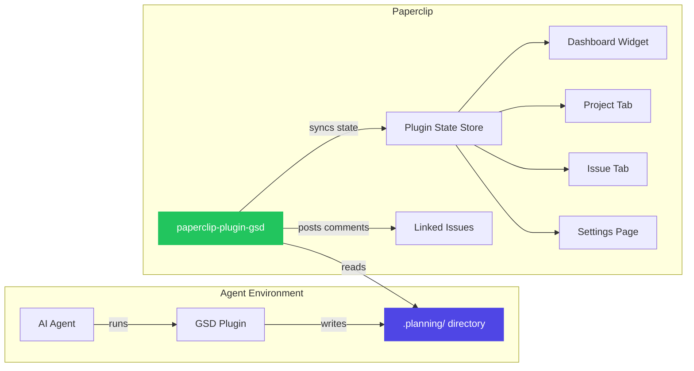
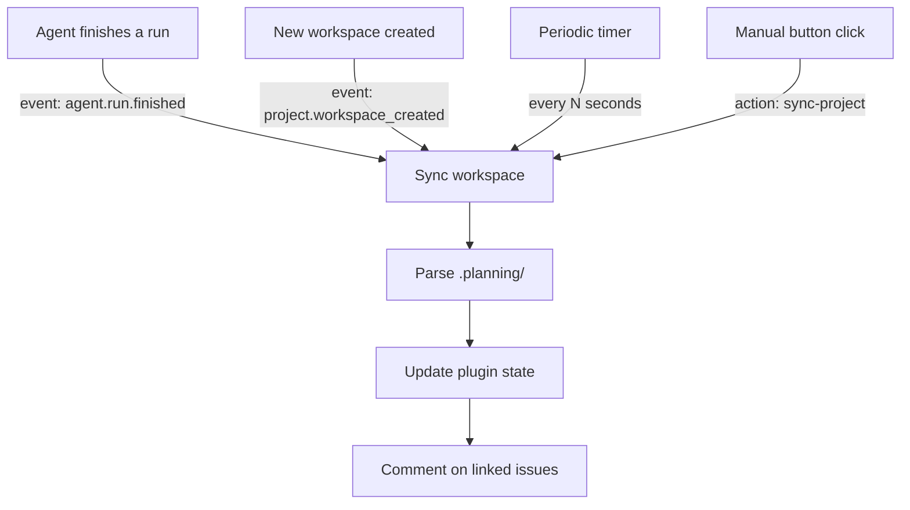
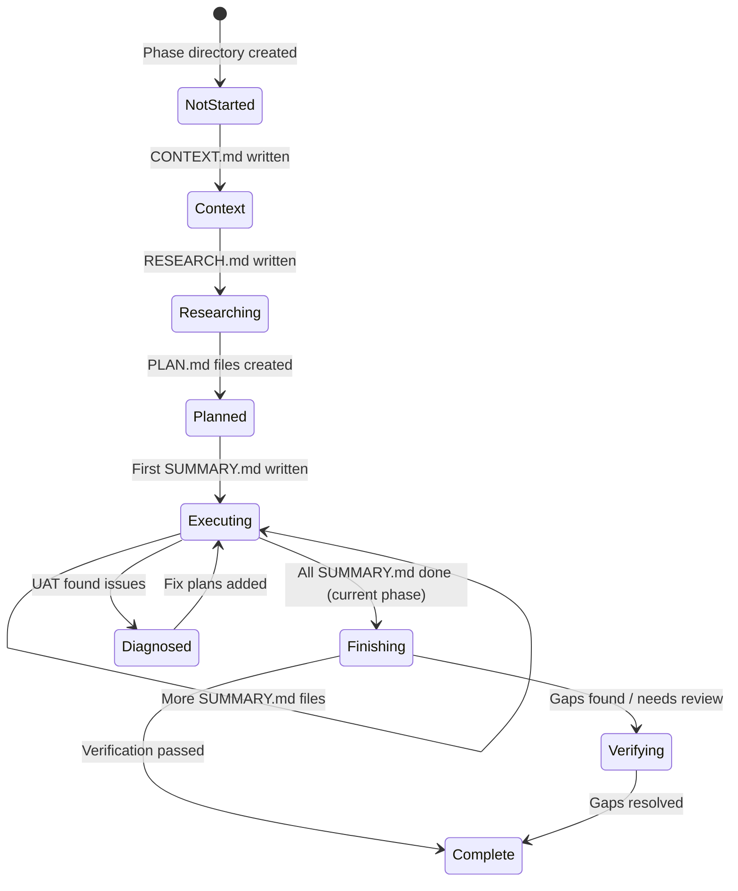

# @codewithahsan/paperclip-plugin-gsd

> Bring your GSD planning workflows into [Paperclip](https://github.com/paperclipai/paperclip) — see phase progress, milestones, and verification status right where you manage your AI agents.

---

## Why this exists

If you use [GSD (Get Shit Done)](https://github.com/get-shit-done/get-shit-done) to plan and execute work with AI agents, you already know how powerful it is. Phases, plans, waves, verification — GSD gives your agents real structure.

But there's a gap: GSD lives in the terminal. Your `.planning/` directory has all the state, but you can't see it from Paperclip's UI. You can't glance at a dashboard and know which phases are done, which agent is executing, or whether verification passed.

This plugin bridges that gap. It reads GSD's `.planning/` files (the single source of truth) and surfaces everything in Paperclip — dashboard widgets, project tabs, issue linking, and more. No reimplementation, no duplication. Just a clean read-only window into what GSD is doing.

## How it works



The plugin **never writes** to `.planning/` — it only reads. GSD remains the single source of truth.

### Sync triggers

The plugin syncs GSD state in three ways:



### Phase lifecycle

GSD phases move through a well-defined lifecycle. The plugin detects where each phase is by analyzing which files exist:



| Status | What it means | How it's detected |
|--------|---------------|-------------------|
| Not Started | Phase directory exists, nothing inside | No CONTEXT, RESEARCH, or PLAN files |
| Context Gathered | Design vision captured | `CONTEXT.md` present |
| Researched | Technical research done | `RESEARCH.md` present |
| Planned | Plans created, ready to execute | `PLAN.md` files exist, no `SUMMARY.md` |
| Executing | Agent is working through plans | Some plans have `SUMMARY.md` |
| Finishing | All plans done, post-execution running | All `SUMMARY.md` exist, still current phase |
| Verifying | Verification found gaps or needs human review | `VERIFICATION.md` status is `gaps_found` or `human_needed` |
| Complete | Phase fully done | All `SUMMARY.md` + verification passed (or no verification) |
| Gaps Found | UAT diagnosed issues | `UAT.md` status is `diagnosed` |

## Getting started

### Prerequisites

- A running [Paperclip](https://github.com/paperclipai/paperclip) instance
- [GSD](https://github.com/get-shit-done/get-shit-done) installed in your agent's environment (Claude Code plugin, Gemini CLI skill, etc.)

### Install the plugin

From npm:

```bash
npx paperclipai plugin install @codewithahsan/paperclip-plugin-gsd
```

From a local clone:

```bash
git clone https://github.com/AhsanAyaz/paperclip-plugin-gsd.git
cd paperclip-plugin-gsd
npm install && npm run build
npx paperclipai plugin install ./
```

### What you'll see

Once installed, the plugin adds five UI components to Paperclip:

| Component | Where | What it shows |
|-----------|-------|---------------|
| **Dashboard Widget** | Main dashboard | Progress overview across all projects |
| **GSD Tab** | Project detail page | Full phase roadmap with progress bars, artifact badges, and verification status |
| **GSD Phase Tab** | Issue detail page | Phase details for issues linked to GSD phases |
| **Sync GSD Button** | Project toolbar | One-click manual sync |
| **GSD Settings** | Plugin settings | Auto-sync toggle, sync interval, agent compatibility table |

### Configuration

Open the GSD Settings page in Paperclip to configure:

- **Auto-sync** — Enable/disable periodic syncing (default: enabled)
- **Sync interval** — How often to check for GSD changes, 10–600 seconds (default: 30s)

### Linking phases to issues

You can link GSD phases to Paperclip issues. When a linked phase makes progress (plans complete, verification runs), the plugin posts a comment on the issue automatically.

Use the `link-phase` action via the plugin API:

```
projectId: "your-project-id"
phaseNumber: "17"
issueId: "your-issue-id"
```

## Architecture

```
src/
├── manifest.ts          # Plugin manifest (capabilities, UI slots, config schema)
├── worker.ts            # Core sync logic, event handlers, data providers, actions
├── gsd-parser.ts        # Reads and parses .planning/ directory structure
├── gsd-types.ts         # TypeScript interfaces for all GSD data structures
├── adapter-compat.ts    # Agent adapter compatibility detection
├── constants.ts         # Plugin IDs, data keys, action keys
└── ui/
    └── index.tsx         # All 5 UI components (React)
```

### Key design decisions

- **Read-only** — The plugin never modifies `.planning/` files. GSD is the single source of truth.
- **File-based detection** — Phase status is inferred from which files exist (CONTEXT.md, RESEARCH.md, PLAN.md, SUMMARY.md, VERIFICATION.md, UAT.md), not from any configuration.
- **Adapter-aware** — Not all agent adapters support GSD. The plugin detects compatibility and surfaces it clearly in the settings page.
- **Event-driven + periodic** — Syncs happen on agent run completion, workspace creation, and on a configurable timer. Manual sync is always available.

## Development

```bash
# Install dependencies
npm install

# Build the plugin (worker + manifest + UI)
npm run build

# Watch mode for development
npm run build:watch

# Run tests
npm test

# Type check
npm run typecheck
```

### Running tests

Tests use [Vitest](https://vitest.dev/) and test the GSD parser against fixture files in `tests/fixtures/.planning/`:

```bash
npm test
```

## Contributing

Contributions are welcome! Whether it's a bug fix, a new feature, or better docs — we'd love your help.

### How to contribute

1. **Fork** the repo
2. **Create a branch** for your change (`git checkout -b feat/my-feature`)
3. **Make your changes** — follow the existing code style
4. **Add tests** if you're changing parser or worker logic
5. **Run `npm test`** to make sure nothing breaks
6. **Open a PR** with a clear description of what you changed and why

### Ideas for contributions

- Better UI components (charts, timeline views)
- Support for more agent adapters
- Phase-to-issue auto-linking based on naming conventions
- Milestone progress tracking across multiple projects
- Notifications when phases complete or verification fails

### Code style

- TypeScript, strict mode
- No unnecessary abstractions — keep it simple
- Tests for parser and worker logic
- UI components use inline styles with CSS variable fallbacks

## Compatibility

- **Paperclip** — tested with the latest version
- **GSD** — compatible with the GSD `.planning/` directory format
- **Agents** — works with Claude Code (`claude_local` adapter, full support), OpenCode (`opencode_local` adapter, full support), process-based agents (partial support). Other adapters will show an informational message.

## License

MIT — see [LICENSE](./LICENSE)

---

Built with care by [Ahsan Ayaz](https://codewithahsan.dev). If this plugin helps your workflow, give it a star!
